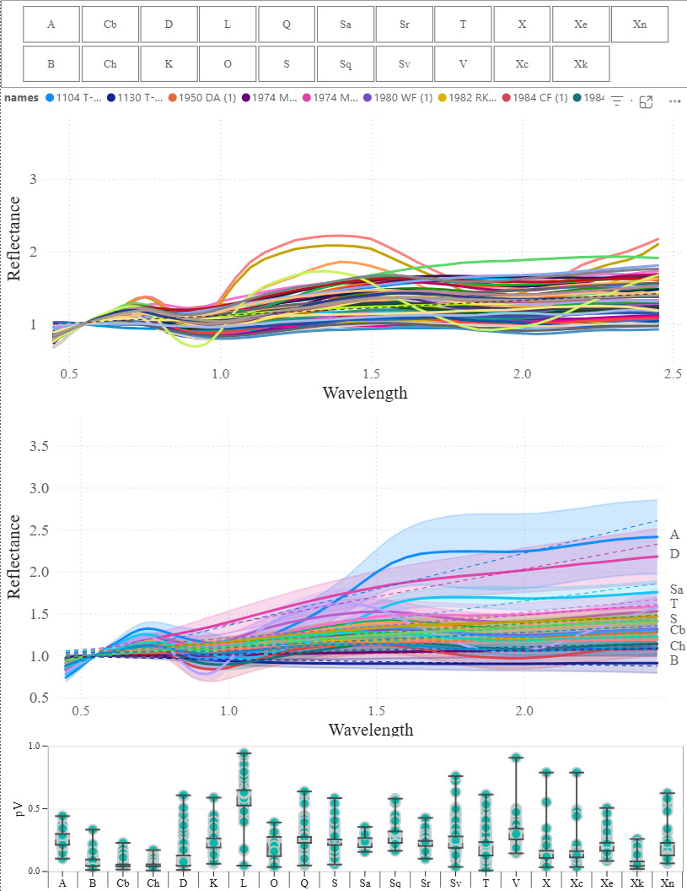
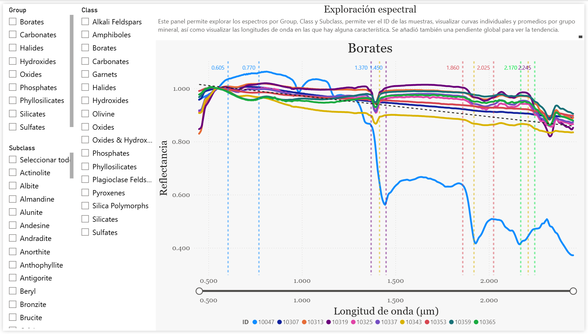
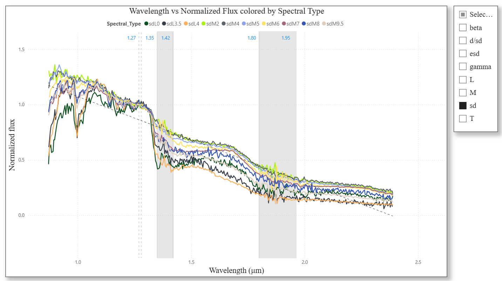
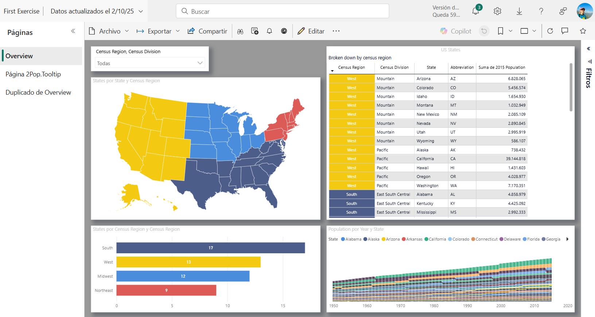
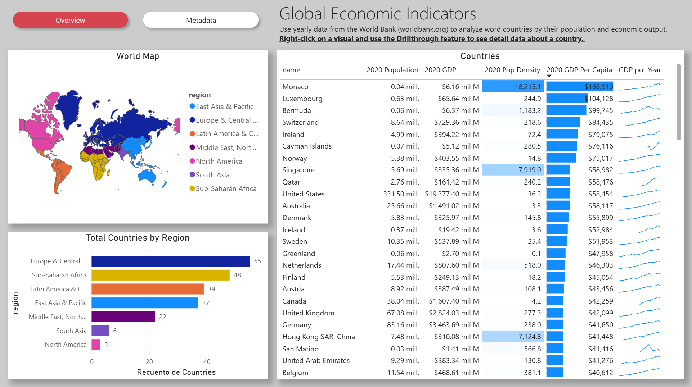
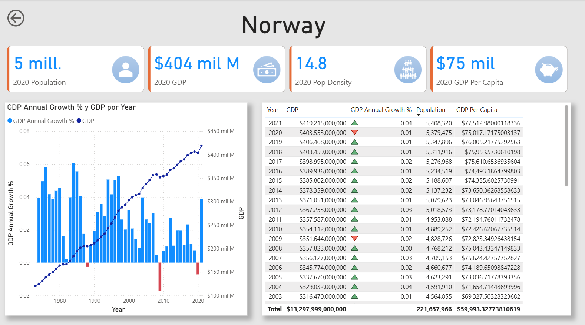
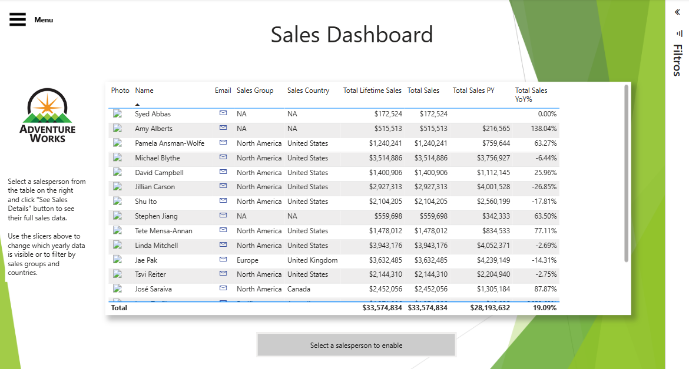
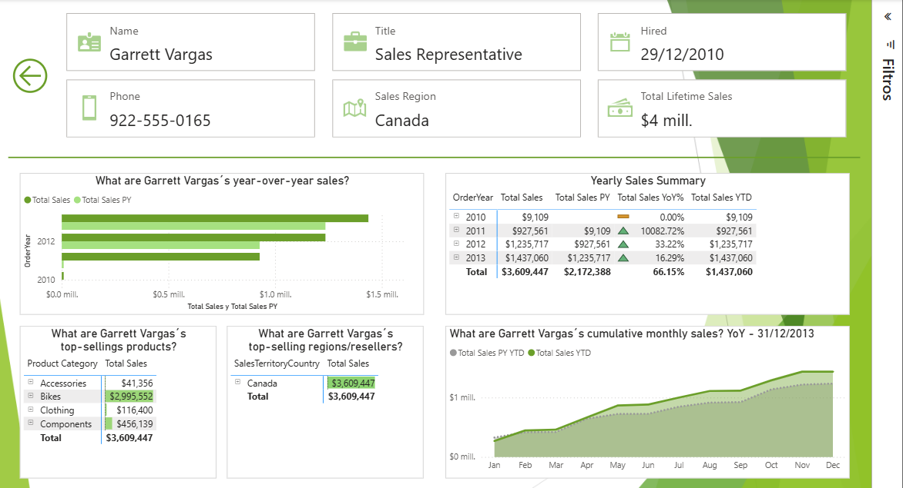

# Portafolio de Ciencia de Datos – Ana V. Ojeda Vera

Este repositorio contiene una selección de proyectos académicos, aplicados y de práctica relacionados con análisis de datos, visualización científica, diseño de dashboards, aprendizaje automático y comunicación de resultados basada en datos.

Algunos proyectos son ejercicios exploratorios desarrollados para practicar flujos de trabajo en Power BI, mientras que otros están relacionados con investigación científica, artículos, pósters y presentaciones en congresos. Cada carpeta contiene los archivos correspondientes al proyecto, incluyendo bases de datos, archivos de Power BI (`.pbix`) e imágenes de referencia que muestran el diseño y funcionamiento de los dashboards.

## Áreas de trabajo

* Análisis y preprocesamiento de datos
* Visualización científica
* Diseño de dashboards en Power BI
* Análisis de datos espectrales
* Clasificación mediante machine learning
* Reducción de dimensionalidad: PCA, t-SNE, UMAP
* Clustering y aprendizaje no supervisado
* Comunicación visual de resultados
* Inteligencia de negocios y análisis exploratorio

## Estructura del repositorio

```text
Asteroides/
Ejercicio1/
Ejercicio2/
Ejercicio3/
Estrellas/
Minerales/
```

Cada carpeta incluye, según el proyecto:

* Base de datos utilizada
* Archivo de Power BI (`.pbix`)
* Imágenes o capturas del dashboard

## Proyectos

### 1. Asteroides – Dashboard de indicadores espectrales y taxonomía

Proyecto enfocado en la comparación de clases taxonómicas de asteroides con base en DeMeo et al. (2009). El dashboard permite analizar diferencias espectrales entre clases, comportamiento de reflectancia, indicadores espectrales y valores de albedo.

Este proyecto está relacionado con el uso de ciencia de datos para apoyar la interpretación de patrones taxonómicos en cuerpos menores del Sistema Solar.

**Carpeta:** `Asteroides/`
**Archivo principal:** `Indicadores.pbix`
**Temas:** Taxonomía de asteroides, datos espectrales, albedo, indicadores espectrales, visualización científica, Power BI.

<p align="center">
  
</p>

---

### 2. Minerales – Dashboard de espectros minerales y bandas de absorción

Dashboard desarrollado para visualizar y comparar espectros de minerales, así como sus bandas de absorción. El proyecto permite explorar diferencias espectrales entre minerales y analizar características diagnósticas asociadas con distintos grupos minerales.

Este tipo de análisis es útil para la interpretación de datos espectrales en ciencias planetarias, mineralogía y teledetección.

**Carpeta:** `Minerales/`
**Archivo principal:** `Minerales2.pbix`
**Temas:** Espectros minerales, bandas de absorción, comparación espectral, visualización científica, Power BI.

<p align="center">
  
</p>

---

### 3. Estrellas – Dashboard de tipos y subtipos espectrales

Dashboard desarrollado para explorar tipos y subtipos espectrales de estrellas. El proyecto permite visualizar información de clasificación estelar y comparar categorías espectrales mediante herramientas interactivas.

Este ejercicio integra conceptos de astronomía, clasificación científica y visualización de datos.

**Carpeta:** `Estrellas/`
**Archivo principal:** `Estrellas.pbix`
**Temas:** Clasificación estelar, tipos espectrales, subtipos estelares, astronomía, visualización de datos, Power BI.

<p align="center">
  
</p>

---

### 4. Ejercicio1 – Dashboard de población de Estados Unidos

Ejercicio práctico en Power BI para analizar datos de población de Estados Unidos por estado, región censal, división censal, año e indicadores de crecimiento poblacional. El dashboard permite explorar tendencias temporales y comparaciones geográficas mediante visualizaciones interactivas.

**Carpeta:** `Ejercicio1/`
**Archivo principal:** `Ejercicio1.pbix`
**Temas:** Análisis poblacional, regiones censales, crecimiento poblacional, mapas, visualización interactiva, Power BI.

<p align="center">
  
</p>

---

### 5. Ejercicio2 – Dashboard de indicadores mundiales

Ejercicio práctico en Power BI para explorar indicadores de desarrollo mundial por país y región. El dashboard incluye variables como población, PIB, PIB per cápita, densidad poblacional, comparaciones regionales y visualizaciones basadas en mapas.

**Carpeta:** `Ejercicio2/`
**Archivo principal:** `Ejercicio2.pbix`
**Temas:** Indicadores mundiales, PIB, población, densidad poblacional, análisis regional, mapas, Power BI.

<p align="center">
  
</p>

<p align="center">
  
</p>

---

### 6. Ejercicio3 – Dashboard de ventas Adventure Works

Ejercicio práctico en Power BI basado en datos de Adventure Works. El dashboard incluye análisis de ventas, desempeño de empleados, productos, regiones, métricas año contra año y navegación interactiva.

Este proyecto está orientado a inteligencia de negocios y análisis de desempeño comercial.

**Carpeta:** `Ejercicio3/`
**Archivo principal:** `Ejercicio3.pbix`
**Temas:** Inteligencia de negocios, análisis de ventas, productos, empleados, desempeño regional, métricas YoY, Power BI.

<p align="center">
  
</p>

<p align="center">
  
</p>

## Herramientas utilizadas

* Power BI
* Power Query
* Excel
* Python
* Pandas
* NumPy
* Scikit-learn
* Matplotlib
* Seaborn
* GitHub

## Objetivo del portafolio

El objetivo de este portafolio es mostrar experiencia práctica en el análisis, procesamiento y visualización de datos mediante proyectos aplicados. Los proyectos incluidos demuestran habilidades en construcción de dashboards, análisis exploratorio, integración de datos, comunicación visual de resultados y aplicación de herramientas de ciencia de datos en contextos científicos y de práctica profesional.

## Contacto

Ana V. Ojeda Vera
Estudiante de Doctorado en Ciencia de Datos
CITEDI-IPN
