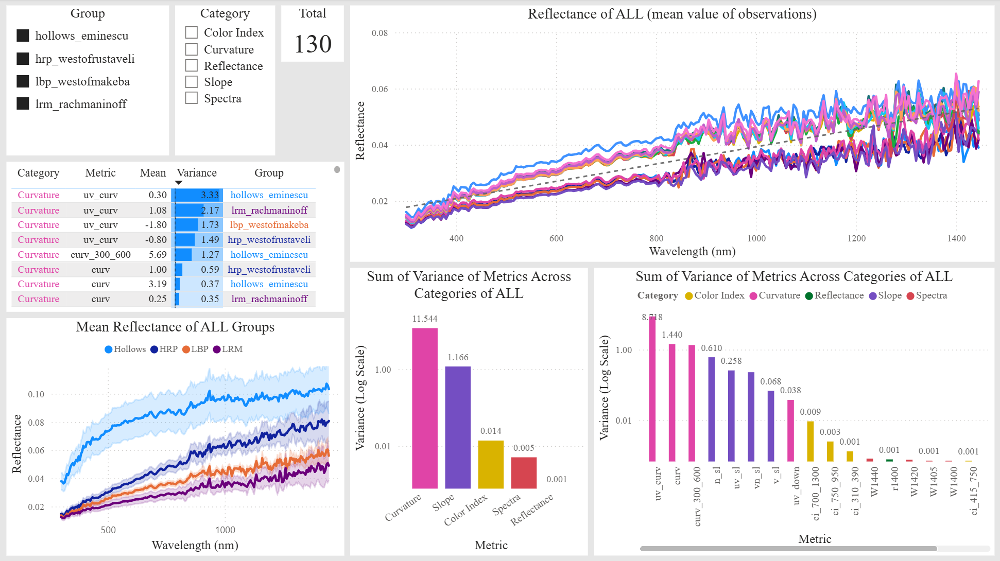

# Data Science Portfolio – Ana V. Ojeda Vera

This repository contains a selection of academic, applied, and practice projects related to data analysis, scientific visualization, dashboard design, machine learning, and data-driven communication.

Some projects are exploratory exercises developed to practice Power BI workflows, while others are related to scientific research, papers, posters, and conference presentations. Each folder contains the corresponding project files, including datasets, Power BI files (`.pbix`), and reference images showing the dashboard design and functionality.

## Areas of Work

* Data analysis and preprocessing
* Scientific visualization
* Power BI dashboard design
* Spectral data analysis
* Machine learning classification
* Dimensionality reduction: PCA, t-SNE, UMAP
* Clustering and unsupervised learning
* Visual communication of results
* Business intelligence and exploratory analysis

## Repository Structure

```text
Asteroides/
Ejercicio1/
Ejercicio2/
Ejercicio3/
Estrellas/
Mercurio/
Minerales/
```

Each folder may include:

* Dataset files
* Power BI report file (`.pbix`)
* Dashboard screenshots or preview images
* Complementary analysis files

## Projects

### 1. Mercurio – Spectral Metrics of Mercury Surface Dashboard

This project focuses on the analysis and visualization of spectral metrics computed from VIS-NIR reflectance spectra of Mercury’s surface using MASCS/VIRS data from NASA’s MESSENGER mission.

This project is related to the paper “Spectral Metrics for Differentiating Mercury Surface Units from MASCS/VIRS VIS-NIR Data”, accepted for publication in the Revista Mexicana de Astronomía y Astrofísica (RMxAA). The dashboard enables the exploration of spectral metrics such as slopes, curvature, color indices, reflectance, and band depths to compare different surface units on Mercury.

**Folder:** `Mercurio/`
**Topics:** Mercury, MASCS/VIRS, VIS-NIR spectra, spectral metrics, planetary surfaces, RMxAA, scientific visualization, Power BI.

<p align="center">  </p>

---

### 2. Asteroides – Spectral Indicators and Taxonomy Dashboard

This project focuses on the comparison of asteroid taxonomic classes based on DeMeo et al. (2009). The dashboard allows the exploration of spectral differences among classes, reflectance behavior, spectral indicators, and albedo values.

This project is related to the use of data science methods to support the interpretation of taxonomic patterns in small bodies of the Solar System.

**Folder:** `Asteroides/`
**Topics:** Asteroid taxonomy, spectral data, albedo, spectral indicators, scientific visualization, Power BI.

<p align="center">
  
</p>

---

### 3. Minerales – Mineral Spectra and Absorption Bands Dashboard

This dashboard was developed to visualize and compare mineral spectra and their absorption bands. The project supports the exploration of spectral differences among minerals and the analysis of diagnostic absorption features associated with different mineral groups.

This type of analysis is useful for the interpretation of spectral data in planetary science, mineralogy, and remote sensing.

**Folder:** `Minerales/`
**Topics:** Mineral spectra, absorption bands, spectral comparison, scientific visualization, Power BI.

<p align="center">
  
</p>

---

### 4. Estrellas – Stellar Spectral Types and Subtypes Dashboard

This dashboard was developed to explore stellar spectral types and subtypes. The project enables the visualization of stellar classification data and the comparison of spectral categories through interactive tools.

This exercise integrates astronomy, scientific classification, and data visualization concepts.

**Folder:** `Estrellas/`
**Topics:** Stellar classification, spectral types, stellar subtypes, astronomy, data visualization, Power BI.

<p align="center">
  
</p>

---

### 5. Ejercicio1 – United States Population Dashboard

This Power BI practice exercise analyzes United States population data by state, census region, census division, year, and population growth indicators. The dashboard enables the exploration of temporal trends and geographic comparisons through interactive visualizations.

**Folder:** `Ejercicio1/`
**Topics:** Population analysis, census regions, population growth, maps, interactive visualization, Power BI.

<p align="center">
  
</p>

---

### 6. Ejercicio2 – World Indicators Dashboard

This Power BI practice exercise explores world development indicators by country and region. The dashboard includes variables such as population, GDP, GDP per capita, population density, regional comparisons, and map-based visualizations.

**Folder:** `Ejercicio2/`
**Topics:** World indicators, GDP, population, population density, regional analysis, maps, Power BI.

<p align="center">
  
</p>

<p align="center">
  
</p>

---

### 7. Ejercicio3 – Adventure Works Sales Dashboard

This Power BI practice exercise is based on Adventure Works data. The dashboard includes sales analysis, employee performance, product analysis, regional comparisons, year-over-year metrics, and interactive navigation.

This project is oriented toward business intelligence and commercial performance analysis.

**Folder:** `Ejercicio3/`
**Topics:** Business intelligence, sales analysis, products, employees, regional performance, YoY metrics, Power BI.

<p align="center">
  
</p>

<p align="center">
  
</p>

## Tools

* Power BI
* Power Query
* Excel
* Python
* Pandas
* NumPy
* Scikit-learn
* Matplotlib
* Seaborn
* GitHub

## Portfolio Objective

The objective of this portfolio is to demonstrate practical experience in data analysis, data processing, and data visualization through applied projects. The included projects show skills in dashboard development, exploratory analysis, data integration, visual communication of results, and the application of data science tools in scientific and professional practice contexts.

## Contact

Ana V. Ojeda Vera
Doctoral Student in Data Science
CITEDI-IPN
